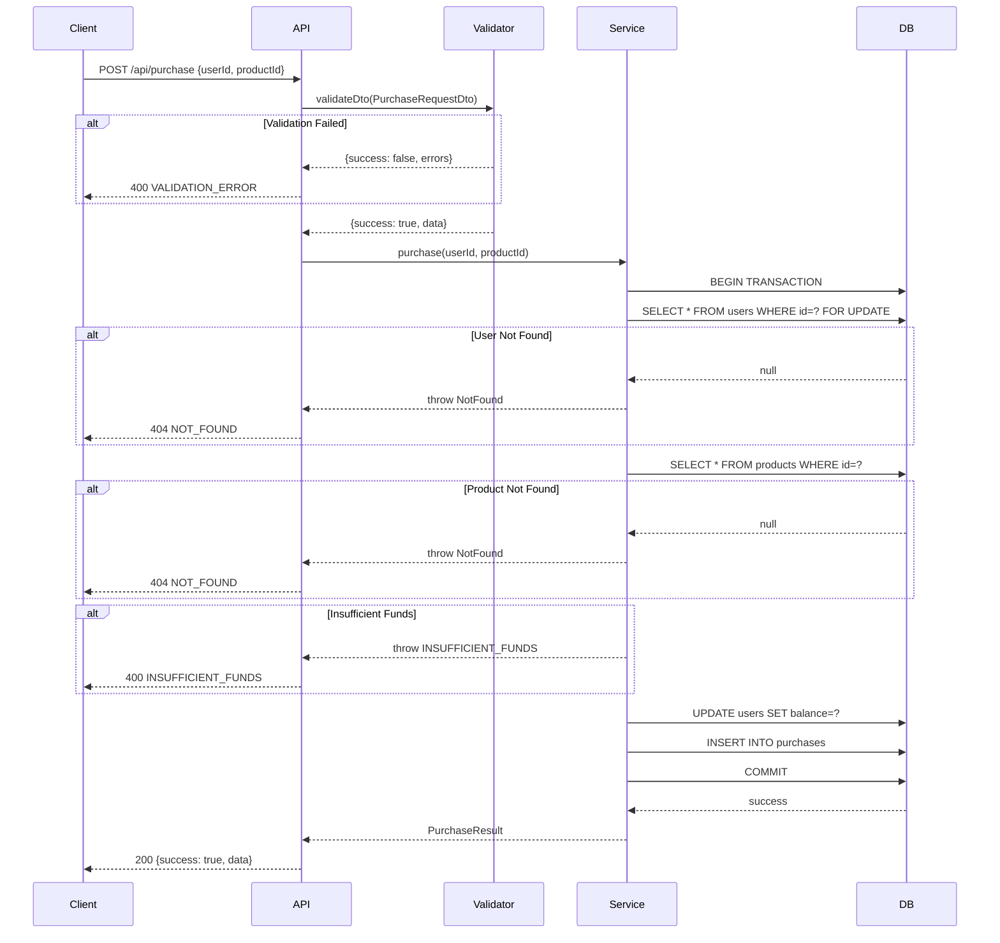

# API Documentation

## Base URL

```
http://localhost:3000
```

## Response Format

Все ответы имеют единый формат:

**Success:**
```json
{
  "success": true,
  "data": { ... }
}
```

**Error:**
```json
{
  "success": false,
  "error": {
    "code": "ERROR_CODE",
    "message": "Human readable message",
    "details": [ ... ]  // optional, for validation errors
  }
}
```

---

## Endpoints

### GET /health

Health check endpoint.

**Response:**
```json
{
  "status": "ok"
}
```

---

### GET /api/items

Получение списка предметов из Skinport API с кешированием.

**Response (200):**
```json
{
  "success": true,
  "data": [
    {
      "name": "AK-47 | Redline (Field-Tested)",
      "minPrice": 12.50,
      "minPriceTradable": 14.99,
      "currency": "USD"
    }
  ]
}
```

**Errors:**

| Code | Status | Description |
|------|--------|-------------|
| EXTERNAL_SERVICE_ERROR | 502 | Skinport API недоступен |
| INTERNAL_ERROR | 500 | Внутренняя ошибка |

---

### POST /api/purchase

Покупка товара с списанием баланса.

**Request:**
```json
{
  "userId": 1,
  "productId": 2
}
```

**Validation:**
- `userId` — integer, positive
- `productId` — integer, positive

**Response (200):**
```json
{
  "success": true,
  "data": {
    "userId": 1,
    "productId": 2,
    "price": 15.49,
    "balance": 84.51
  }
}
```

**Errors:**

| Code | Status | Description |
|------|--------|-------------|
| VALIDATION_ERROR | 400 | Невалидные данные |
| INSUFFICIENT_FUNDS | 400 | Недостаточно средств |
| NOT_FOUND | 404 | Пользователь или продукт не найден |
| INTERNAL_ERROR | 500 | Внутренняя ошибка |

**Validation Error Example:**
```json
{
  "success": false,
  "error": {
    "code": "VALIDATION_ERROR",
    "message": "Request validation failed",
    "details": [
      {
        "field": "userId",
        "message": "userId must be a positive number",
        "constraints": ["userId must be a positive number", "userId must be an integer"]
      }
    ]
  }
}
```

---

## Sequence Diagram

> Исходник: [diagrams/purchase-sequence.mmd](diagrams/purchase-sequence.mmd)



---

## Error Codes

| Code | Status | Description |
|------|--------|-------------|
| VALIDATION_ERROR | 400 | Ошибка валидации входных данных |
| INSUFFICIENT_FUNDS | 400 | Недостаточно средств на балансе |
| NOT_FOUND | 404 | Ресурс не найден |
| EXTERNAL_SERVICE_ERROR | 502 | Ошибка внешнего сервиса |
| INTERNAL_ERROR | 500 | Внутренняя ошибка сервера |
